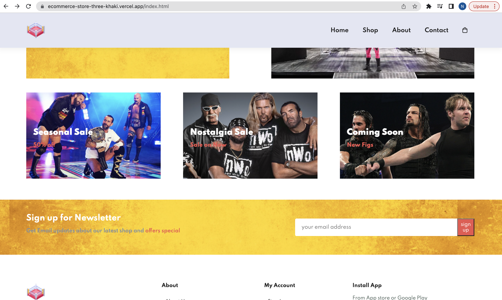
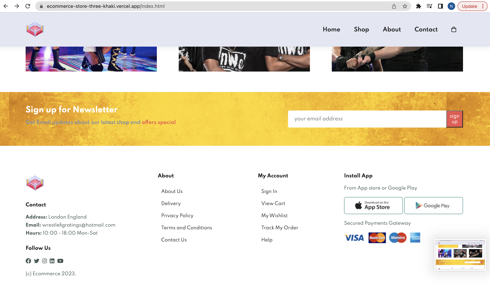
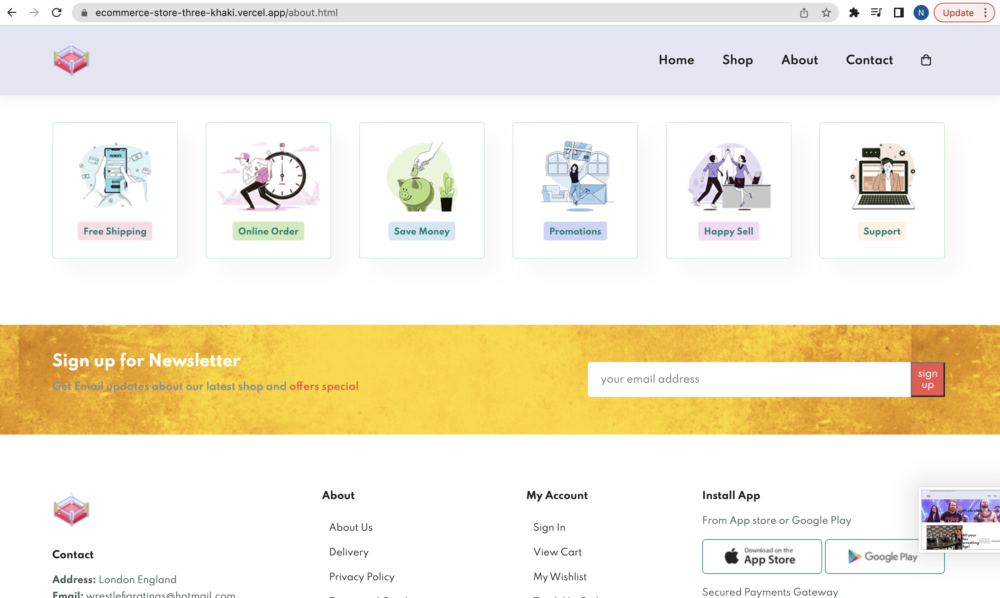

# Ecommerce-Store-
Ecommerce Website With HTML CSS JavaScript

I made a responsive ecommerce store with 5 pages. it is responsive on all 4 devices. I used HTML5/CCS3 and a small amount of Javascript

Live Website - https://ecommerce-store-three-khaki.vercel.app/index.html

Responsiveness - 

Pictures below from every page

Thanks!

Home page

Shop Page

About Page

Contact Page

Cart Page

